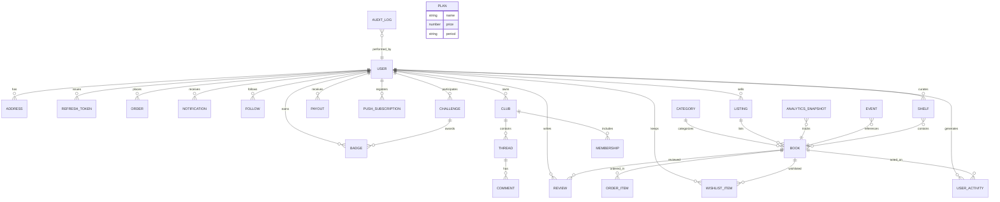

# §13.6.2 — Entity–Relationship Diagram

Mermaid ER diagram of the MongoDB domain model (each box = a Mongoose
collection; `1:N` relationships are `ref` object ids).

## Notes on the sparse cross-cutting collections

- **`events`** — anonymized funnel/recommendation events keyed by a
  client-generated `sessionId` and an optional authenticated `user` id
  (§13.3 attribution source). Data is free-form JSON in `data`.
- **`auditlogs`** — write-time audit trail for admin actions (who, what, when,
  metadata), linked to the acting admin (`AuditLog.actor` refs `User`; "admin"
  is a `role` value on `User`, not a separate collection — see below).
- **`book.embedding`** — not an ER edge: a 768-d float array on the book
  document (`select: false`), consumed by the vector similarity paths and the
  §13.2 offline evaluation.
- **`user.recommendationArm`** — §13.3 experiment flag on the user document;
  no schema default (assigned lazily on first homepage fetch to randomize
  existing users).
- **`plans`** — a standalone content collection for the `/plans` pricing page
  (name/price/period/features). No model currently references it by id —
  it isn't wired to an active per-user subscription, just displayed.

## Corrections (2026-08-27 re-verification against `models/*.ts`)

Cross-checked every diagram entity against the 22 real Mongoose model files
(there is no `Wishlist`, `OrderItem`, `Membership`, or `AdminUser` model —
those four names in the previous version of this diagram didn't correspond
to any actual collection):

- **Added `PLAN` and `SHELF`** — both are real standalone collections
  (`models/Plan.ts`, `models/Shelf.ts`, Phase 6 community feature) that were
  missing entirely from the original diagram. `Shelf.user` refs `User`
  (1:N, "curates"); `Shelf.books` is a `Book` id array (N:M, "contains").
  `Plan` has no incoming refs from any model — it's content for the pricing
  page, not linked to a per-user subscription.
- **`WISHLIST_ITEM`** in the diagram is really `User.wishlist`, a `Book` id
  array embedded directly on the user document — not its own collection.
  The `USER ||--o{ BOOK : wishlists` edge is conceptually right; there is no
  separate `wishlist_items` collection to draw as its own box.
- **`ORDER_ITEM`** is a real embedded subdocument array (`Order.items`,
  `orderItemSchema`) — accurate as drawn, just embedded rather than a
  separate top-level collection.
- **`MEMBERSHIP`** doesn't exist as a collection — `Club.members` is a plain
  `User` id array embedded on the club document.
- **`ADMIN_USER`** doesn't exist as a collection either — "admin" is a
  `role` enum value on the one `User` model. The `AUDIT_LOG` edge above was
  corrected to point at `USER` directly.