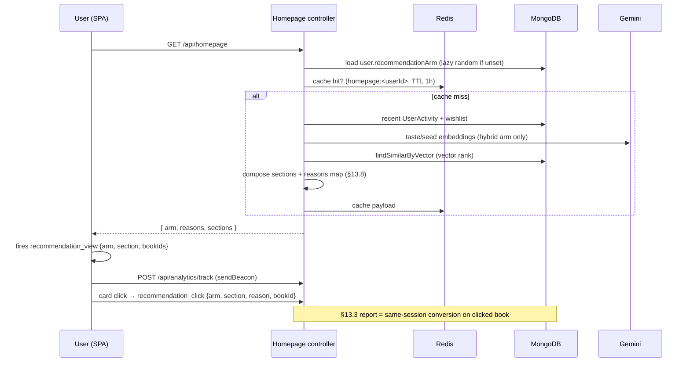
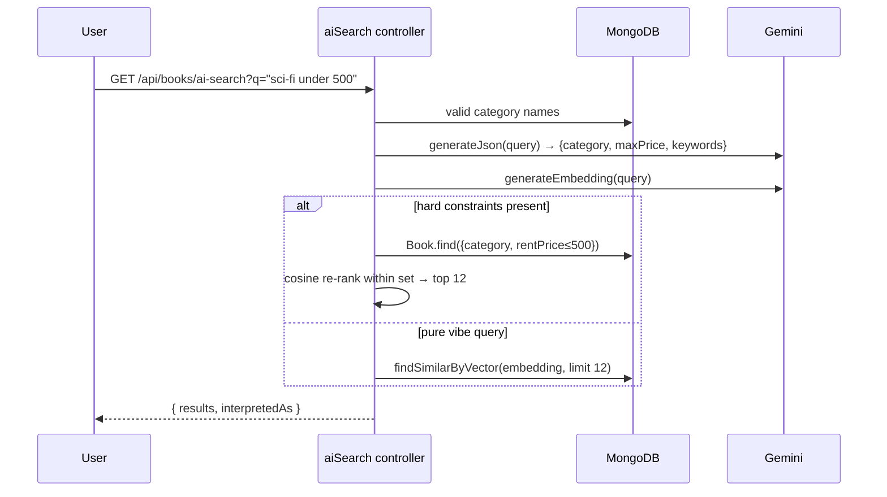
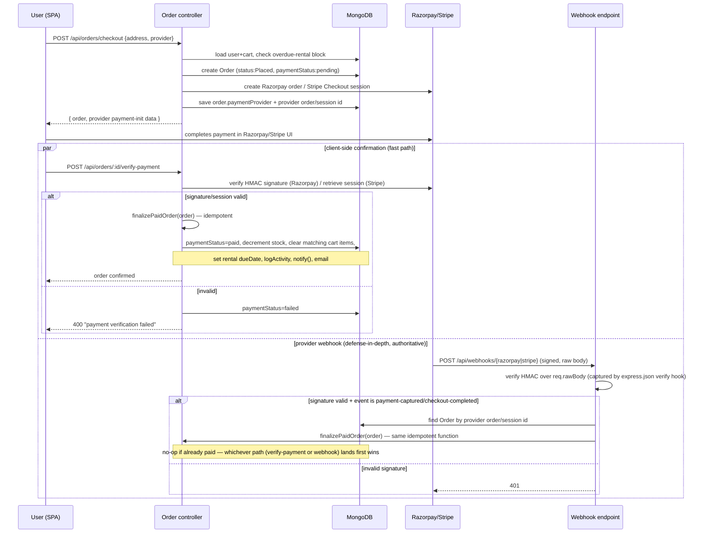
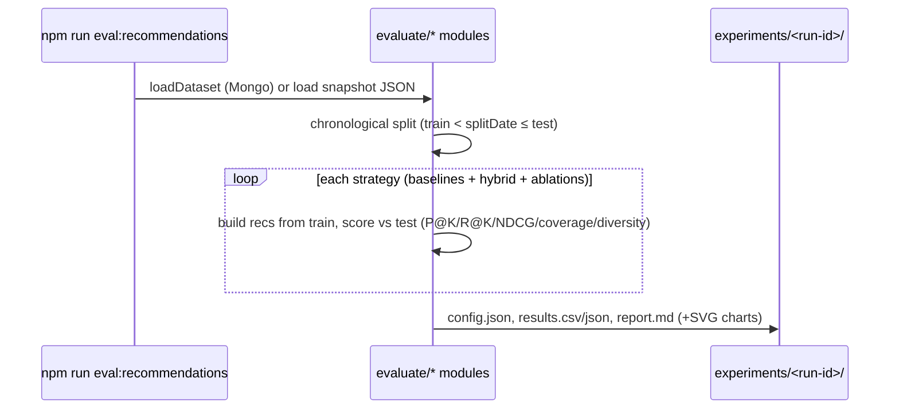

# §13.6.3 — Sequence Diagrams

Mermaid sequence diagrams for the four highest-value flows. These are the
flows the evaluation layer (§13.2–13.4) measures, so each diagram notes where
the measurement hooks in.

## 1. Hybrid recommendation serving + attribution (§13.3 / §13.8)

## 2. AI search (query parse → hard filter → vector rank)

## 3. Checkout + payment verification + webhook confirmation (write path used
   by the k6 checkout benchmark)

*(Corrected 2026-08-27 — the previous version showed a single synchronous
checkout that decremented stock inline; the real code deliberately splits
order creation from payment confirmation and never trusts a client-only
"it succeeded" claim, per the comment at `orderController.ts:57-59`.)*

**Why both paths call the same `finalizePaidOrder`:** the client-side
`verify-payment` call gives the buyer instant confirmation without waiting on
the provider's webhook ping, while the webhook is the authoritative
confirmation that doesn't depend on the buyer's browser staying open. Both
paths converge on one idempotent function (`if (order.paymentStatus ===
"paid") return;`), so whichever fires first does the real work and the other
is a safe no-op — this is what prevents double stock-decrement or a
duplicate confirmation email if both happen to fire.

**Local-dev caveat (documented in code):** the Razorpay/Stripe webhook path
is unexercised in this environment — the providers can't call back to
`localhost`, so only the client-verify path has actually been run here. This
is called out explicitly rather than left implicit, since a diagram showing
both paths could otherwise read as "both were tested."

## 4. Offline evaluation run (§13.2)

